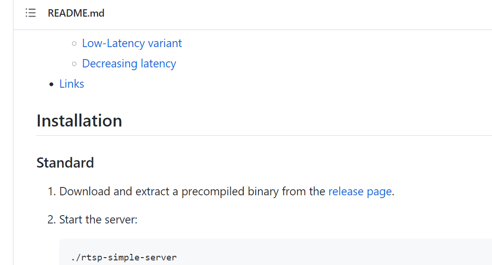
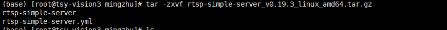

1.下载rtsp服务器
https://github.com/aler9/rtsp-simple-server/releases
在README.md的release页面下载编译好的软件

解压的内容如下：

运行这个rtsp-simple-server即可，为下面的ffmpeg推流提供服务
2.安装ffmpeg(这里采用已编译好的)
wget https://johnvansickle.com/ffmpeg/builds/ffmpeg-git-amd64-static.tar.xz
解压：
xz -d ffmpeg-git-amd64-static.tar.xz
然后把解压出的包解包
tar -xvf 包
然后将可执行文件ffmpeg和ffprob移动到PATH包含的路径下即可，比如mv ffmpeg ffprob /usr/bin
3.本地视频推流(参考1：https://blog.csdn.net/shelgi/article/details/125295772?utm_medium=distribute.pc_relevant.none-task-blog-2~default~baidujs_baidulandingword~default-0-125295772-blog-121267251.pc_relevant_default&spm=1001.2101.3001.4242.1&utm_relevant_index=3)
ffmpeg -re -stream_loop -1 -i ./videos/mask.mp4 -c copy -f rtsp rtsp://127.0.0.1:8554/stream1 其中-stream_loop -1表示循环播放

